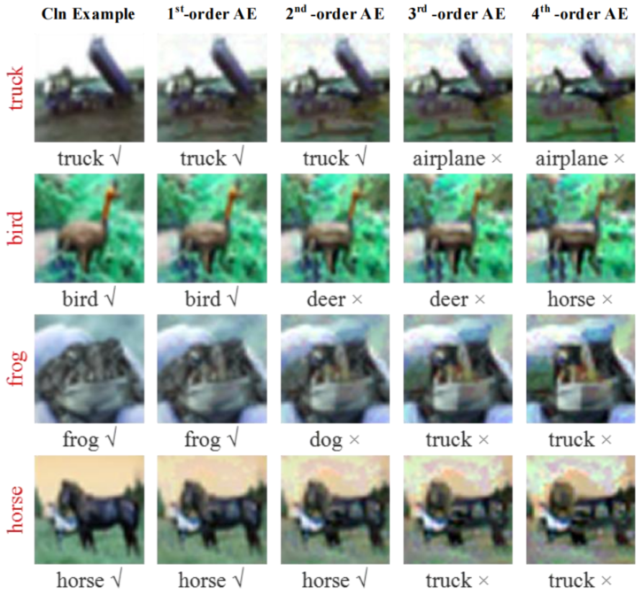
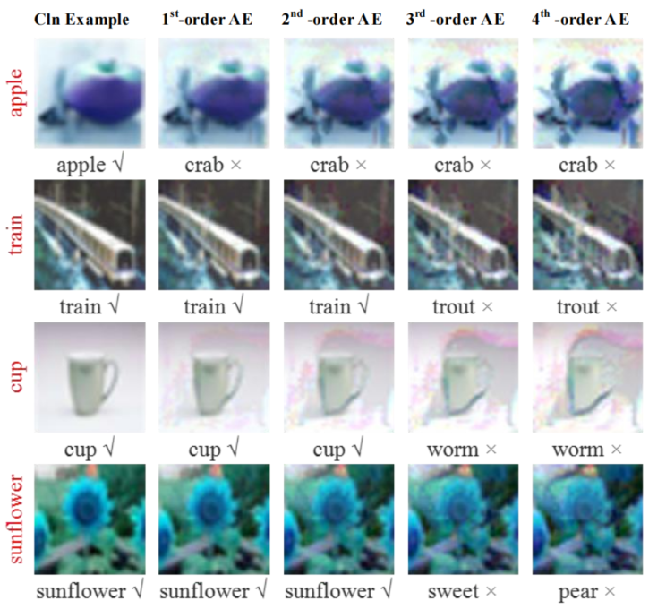
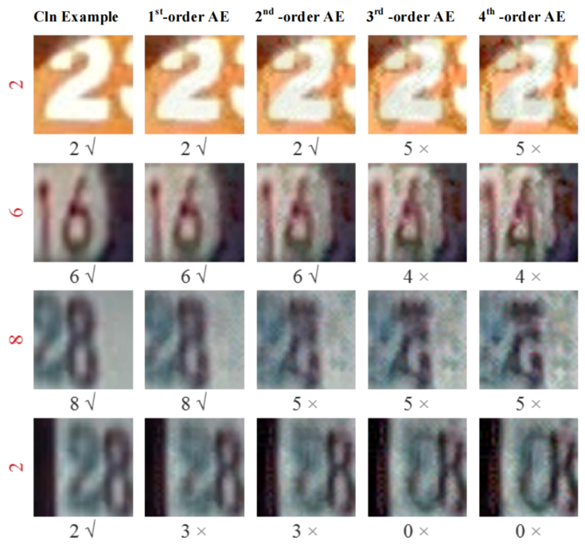
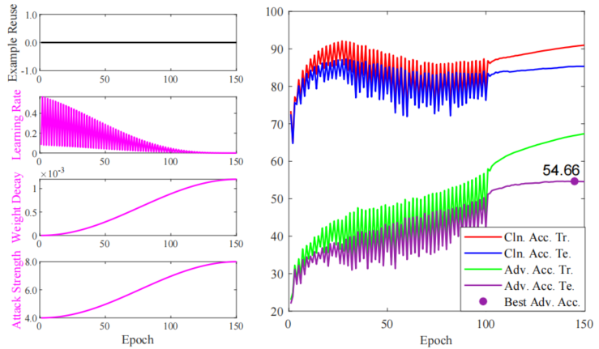
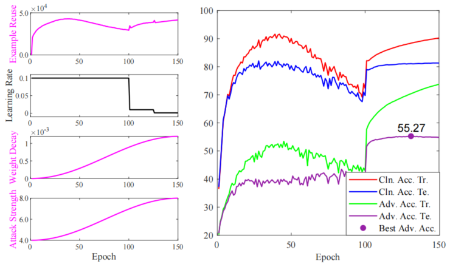
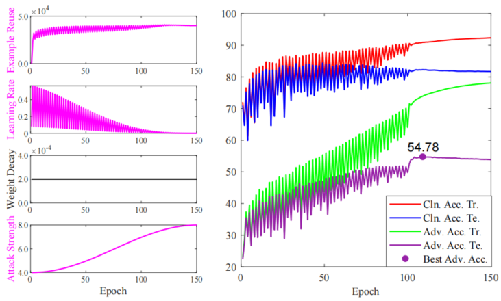
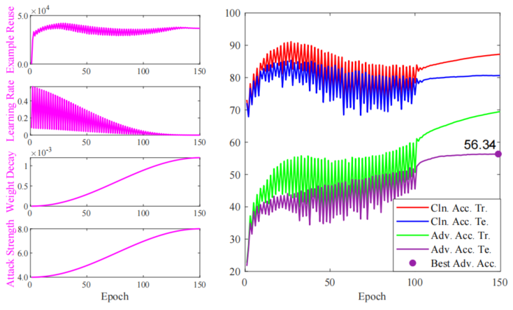

# AT-AER: Adversarial Training with Adaptive Example Reuse (submitted CAAI Transactions on Intelligence Technology)


This repository is a PyTorch implementation of the AT-AER. The paper has been submitted to CAAI Transactions on Intelligence Technology.


## Framework
The framework of Margin-SNN.


## High-ordered AE

<table?
  <tr>
     <td> <center>  (a) Progressive AE evolution of CIFAR-10 </center> </td>
     <td> <center>  (a) Progressive AE evolution of CIFAR-100 </center> </td>
     <td> <center>  (a) Progressive AE evolution of SVHN </center> </td>
   </tr>
</table>

#### Progressive AE evolution of CIFAR-10


#### Progressive AE evolution of CIFAR-100


#### Progressive AE evolution of SVHN


## Ablation of AT-AER 

#### Training process of AT-AER⌝R

#### Training process of AT-AER⌝L

#### Training process of AT-AER⌝W

#### Training process of AT-AER⌝A

#### Training process of AT-AER


## train AT-AER
 
``nohup python main.py --cuda 0 --dataset cifar10 --savemodels ./savemodels-cifar10 --logs ./logs-cifar10 > train_cifar10.log 2>&1``

AT-AER can be trained on other datasets in the same way as cifiar10


## Citation
```
@article{Hu2026AT_AER,
  author = "Meng, Hu and Yanting, Guo and Ran, Wang and Xizhao, Wang, Rihao, Li and Qin, Wang",
  title = "AT-AER: Adversarial Training with Adaptive Example Reuse",
  journal = "submitted to CAAI Transactions on Intelligence Technology",
  year = "2026"
}
```


