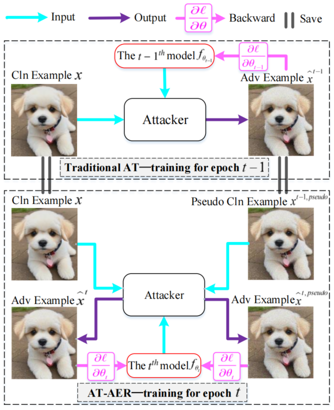
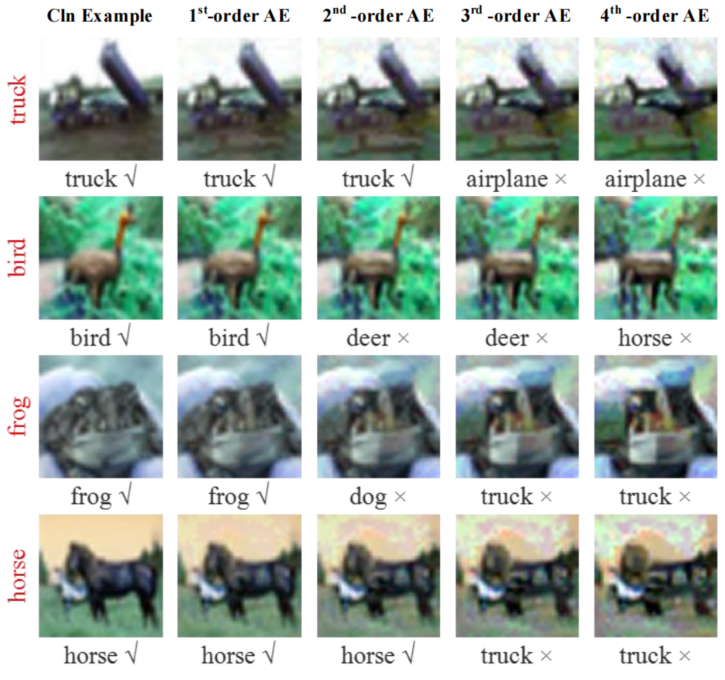
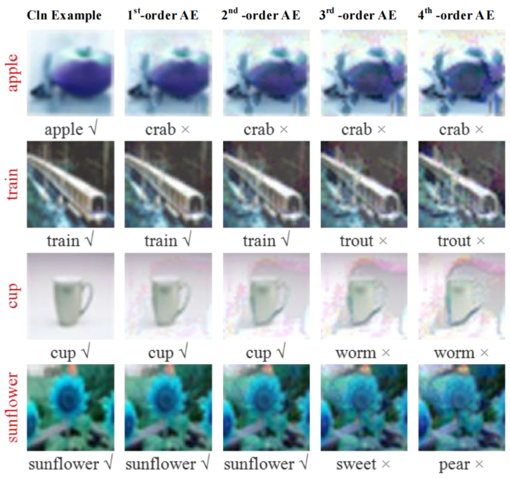
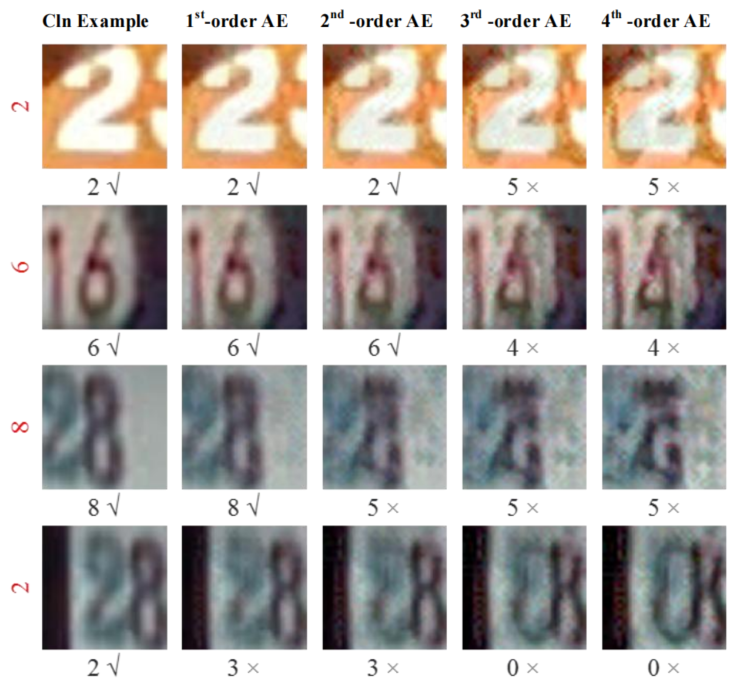
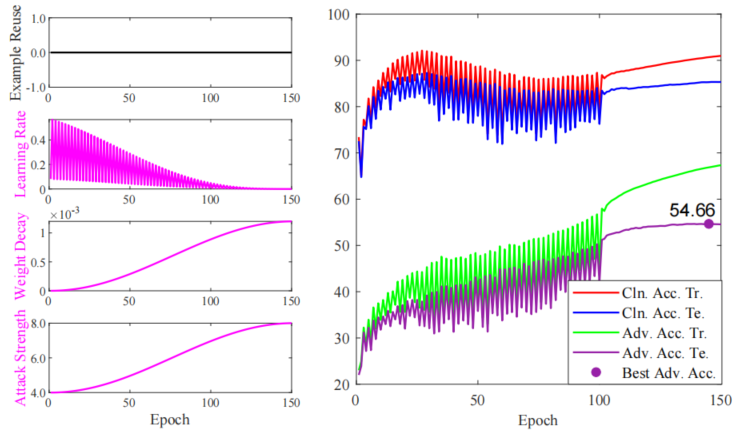
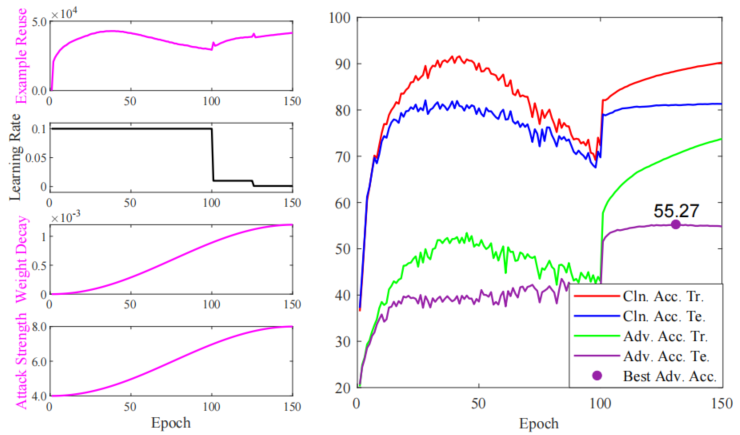
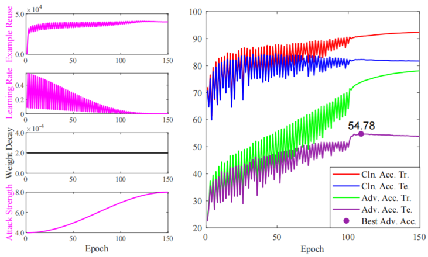
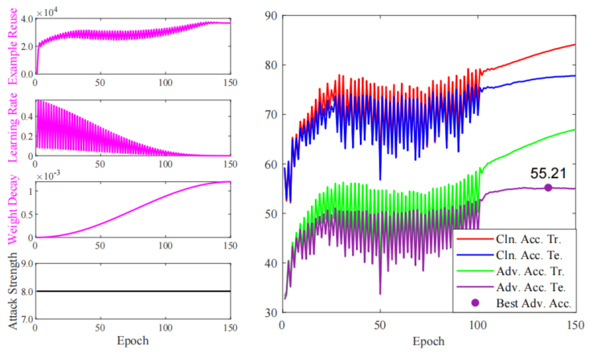
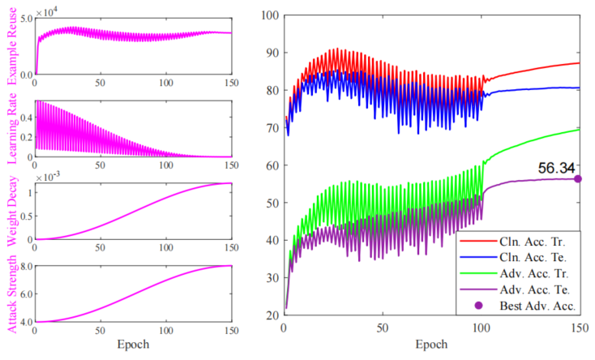

# AT-AER: Adversarial Training with Adaptive Example Reuse

<div align="center">


</div>

## 📖 Overview

This repository provides the official PyTorch implementation of **AT-AER (Adversarial Training with Adaptive Example Reuse)**, proposed in:

> **Meng Hu, Yanting Guo, Ran Wang, Xizhao Wang, Rihao Li, Qin Wang**, AT-AER: Adversarial Training With Adaptive Example Reuse, **CAAI Transactions on Intelligence Technology**, 2026, 00:1–15.
> ## 📄 Paper Link
> - [***CAAI Transactions on Intelligence Technology (Official Publication)***](https://ietresearch.onlinelibrary.wiley.com/doi/10.1049/cit2.70121)  
<!-- > 📑 [PDF Download](https://ietresearch.onlinelibrary.wiley.com/doi/epdf/10.1049/cit2.70121) -->

AT-AER introduces an adaptive adversarial training framework that reuses historical adversarial examples (AEs) in a progressively optimized manner. Instead of discarding previously generated examples, AT-AER strategically integrates high-order adversarial examples into the training pipeline, significantly improving robustness and training efficiency.

---

## ✨ Key Features

- 🔒 **Adaptive Example Reuse (AER)** for enhanced adversarial robustness
- 🧠 Progressive high-order adversarial example integration
- 📈 Improved adversarial training efficiency
- 🛡️ Strong defense against:
  - FGSM
  - PGD
  - CW
  - AutoAttack (AA)
  - Adaptive AutoAttack ($A^{3}$)
- 🌍 Supports CIFAR-10, CIFAR-100, SVHN, and extensible datasets
- 🚀 PyTorch implementation for reproducible research

---

## 🧠 Framework

### Framework of Standard AT and AT-AER

<p align="center">
  
</p>

### Core Insight

AT-AER adaptively reuses previously generated adversarial examples to construct progressively higher-order adversarial supervision, allowing the model to better capture adversarial manifolds while reducing redundant computational overhead.

---

## 🔬 High-Order Adversarial Examples

<table>
  <tr>
     <td><center><br>(a) Progressive AE evolution of CIFAR-10</center></td>
     <td><center><br>(b) Progressive AE evolution of CIFAR-100</center></td>
     <td><center><br>(c) Progressive AE evolution of SVHN</center></td>
   </tr>
</table>

---

## 🧪 Ablation Study of AT-AER

<table>
  <tr>
     <td><center><br>(a) AT-AER⌝R</center></td>
     <td><center><br>(b) AT-AER⌝L</center></td>
   </tr>
   <tr>
     <td><center><br>(c) AT-AER⌝W</center></td>
     <td><center><br>(d) AT-AER⌝A</center></td>
   </tr>
   <tr>
     <td colspan="2"><center><br>(e) Full AT-AER</center></td>
   </tr>
</table>

---

## 🛠️ Requirements

### System Environment

- Ubuntu 16.04.7 / Ubuntu 20.04+
- Python >= 3.9
- PyTorch 1.8.1
- advertorch 0.2.3
- torchattacks 3.4.0
- numpy 1.23.5

### Installation

```bash
conda create -n at_aer python=3.9
conda activate at_aer

pip install torch==1.8.1 torchvision
pip install advertorch==0.2.3
pip install torchattacks==3.4.0
pip install numpy==1.23.5
````

---

## 📂 Repository Structure

```bash
AT-AER/
│
├── figs/
│   ├── framework.png
│   ├── high-order AE figures
│   └── ablation figures
│
├── savemodels-cifar10/
├── logs-cifar10/
├── utils/
│   ├── attacks/
│   ├── datasets/
│   └── evaluation/
│
├── main.py
├── LICENSE
└── README.md
```

---

## 🚀 Training

### Train on CIFAR-10

```bash
nohup python main.py --cuda 0 --dataset cifar10 --savemodels ./savemodels-cifar10 --logs ./logs-cifar10 > train_cifar10.log 2>&1
```

### Train on Other Datasets

AT-AER can be trained on CIFAR-100, SVHN, or custom datasets using the same pipeline.


---

## 📈 Evaluation

Recommended metrics:

* Natural Accuracy
* FGSM Accuracy
* PGD-20 / PGD-100
* CW Attack
* AutoAttack (AA)
* Adaptive AutoAttack ($A^{3}$)
* Training Efficiency


## 📝 Citation

If you find this work useful, please cite:

```bibtex
@article{Hu2026ATAER,
  author  = {Meng Hu and Yanting Guo and Ran Wang and Xizhao Wang and Rihao Li and Qin Wang},
  title   = {AT-AER: Adversarial Training With Adaptive Example Reuse},
  journal = {CAAI Transactions on Intelligence Technology},
  year    = {2026},
  pages   = {1--15},
  doi     = {10.1049/cit2.70121}
}
```

---

## 🤝 Acknowledgements

We sincerely thank:

* PyTorch
* Advertorch
* Torchattacks
* CAAI Transactions on Intelligence Technology
* Adversarial Machine Learning Community

---

## 📬 Contact

**Meng Hu**
>  - 🌐 Address: Shenzhen University, Shenzhen, Guangdong, China
>  - 📧 Email: humeng@szu.edu.cn
>  - 💻 Research Interests: Adversarial Training, Robust Learning, Uncertainty Information Processing
>  - 📄 GitHub: https://github.com/humeng24
